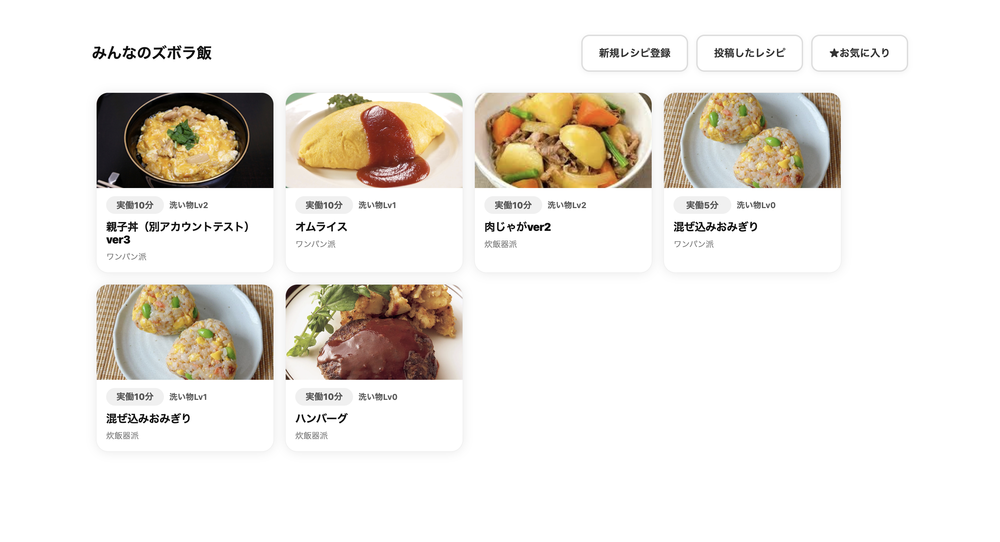
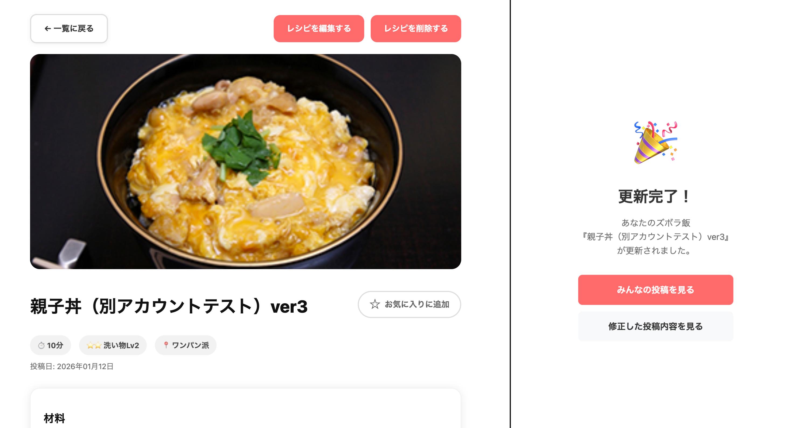
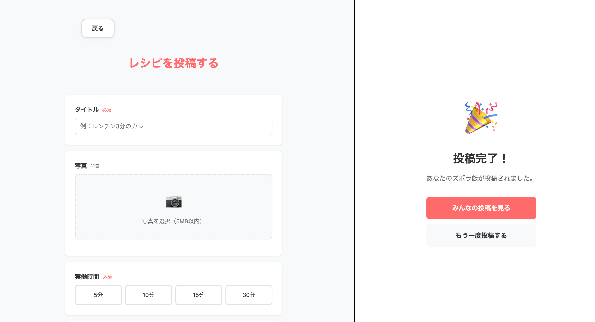
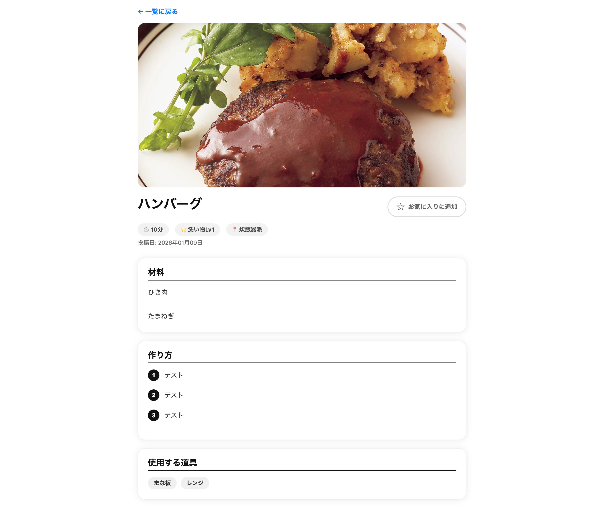
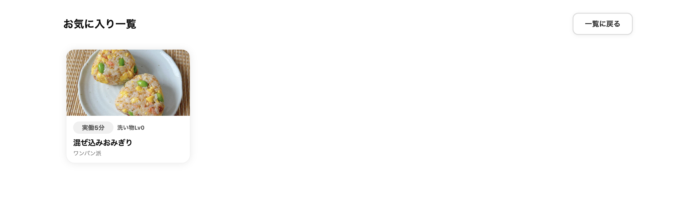

# ①課題名：みんなのズボラメシ

## ②課題内容（どんな作品か）
- 「料理するのがめんどくさい…」「料理を続けようとしても続かない…」そんな人に向けた、ズボラ飯特化のレシピSNS。ズボラで美味しいが評価されるSNS。先週から以下の部分をアップデートしました。&nbsp;&nbsp;
    - ①【レシピ更新/削除機能】　 
            自分が投稿したレシピページの右上に「更新」「削除」ボタンを追加（自分以外のユーザーが登録したデータの更新削除は不可）
    - ②【My投稿レシピ一覧ページ】 
            自分が投稿したレシピだけが一覧で表紙されるページを追加

## ③アプリのデプロイURL
https://olive5g72.sakura.ne.jp/gs_0108_cooking_list/login/login.php

## ⑤工夫した点・こだわった点
- データの登録削除ができるのは、投稿したユーザーのみに絞った点
- 更新後すぐにページを確認できるように、ボタンの遷移先に個別の遷移先リンクを設定した点

## ⑥難しかった点・次回トライしたいこと（又は機能）
- ページが増えてきて、UIUXが悪くなってきた気がするので、自分が投稿したページはマイページから見られるようにするなど、使いやすさをもう少し追求したい。
- ログアウト機能を追加したい。

